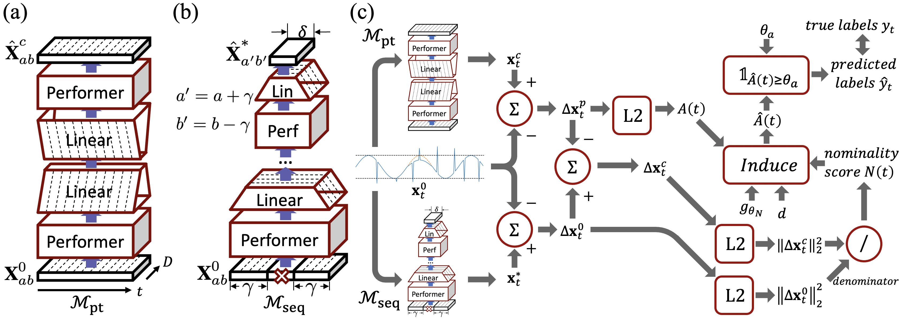
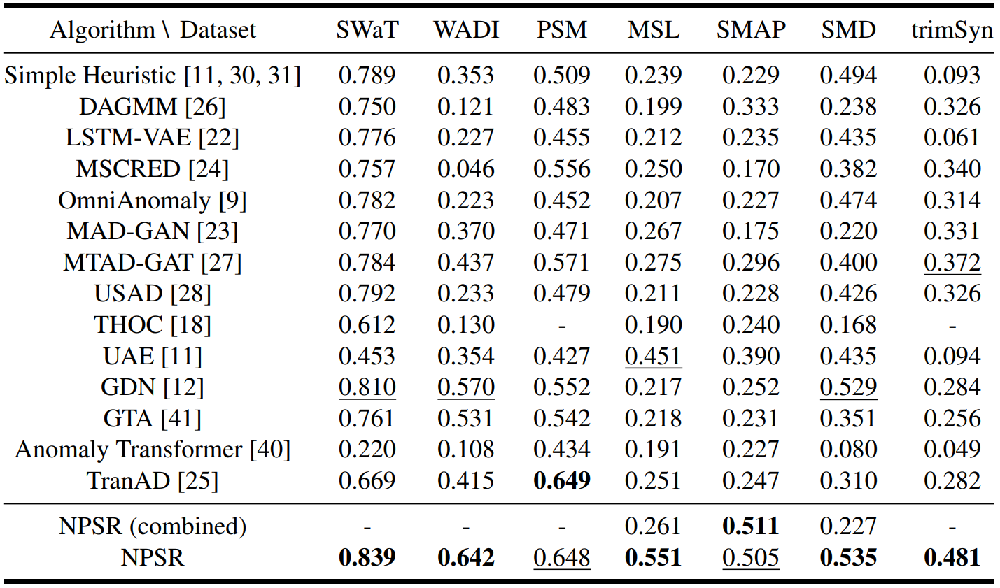

# NPSR (NeurIPS 2023) (--- Under construction ---)
## Nominality Score Conditioned Time Series Anomaly Detection by Point/Sequential Reconstruction

Official PyTorch implementation for **N**ominality Score Conditioned Time Series Anomaly Detection by **P**oint/**S**equential **R**econstruction (NPSR).

A major difficulty for time series anomaly detection arises from modeling time-dependent relationships to find **contextual anomalies** while maintaining detection accuracy for **point anomalies**. In this paper, we propose NPSR, an algorithm that utilizes point-based and sequence-based reconstruction models. The point-based model quantifies point anomalies, and the sequence-based model quantifies both point and contextual anomalies. We formulate the observed time point $\textbf{x}^0_t$ is a two-stage deviated value from a nominal time point $\textbf{x}^*_t$.

$$
  \textbf{x}^0_t = \textbf{x}^*_t + \Delta\textbf{x}^c_t + \Delta\textbf{x}^p_t
$$

Under this formulation, we link the reconstruction errors with the deviations (anomalies) and introduce a nominality score $N(\cdot)$. We derive an induced anomaly score $\hat{A}(\cdot)$ by further integrating $N(\cdot)$ and the original anomaly score $A(\cdot)$. $\hat{A}(\cdot)$ is **theoretically proven** to be superior over $A(\cdot)$ under certain conditions.

<p align="center">
  
</p>
<p align="center">
  Figure 1. (a) Performer-based autoencoder $M_{pt}$, (b) Performer-based stacked encoder $M_{seq}$, and (c) main scheme for NPSR.
</p>

## Main Results
We evaluate the performance of NPSR against 14 baselines over 7 datasets using the best F1 score ($\mathrm{F}1^\*$).

**Note**: Due to reliability concerns, we didn't use the point-adjusted best F1 score ($\mathrm{F}1^\*_{\mathrm{PA}}$) as the main metric. (See Appendix D)

<p align="left">
  Table 1. Best F1 score ($\mathrm{F1^*}$) results on several datasets, with bold text denoting the highest and underlined text denoting the second highest value. The deep learning methods are sorted with older methods at the top and newer ones at the bottom.
</p>
<p align="center">
  
</p>

## Setup

### Prerequisites

### Getting Started
Installation (to install pytorch cf. https://pytorch.org/get-started/locally/):
```shell
conda create -n npsr python=3.11
conda activate npsr
pip install torch torchvision torchaudio
pip install -r requirements.txt
```

## Train and Test
```config.txt``` contains all the settings

[Training]
```shell
usage: python main.py config.txt
```

[Testing]
The algorithm will do an evaluation every epoch

## Visualization
After training, it is possible to use 'parse_results.ipynb' to visualize the training results.

## Datasets
### Preparation
Dataset folders should be put under ```./datasets/[DATASET]```

After downloading and putting the files/dir in the correct folder (folder name should match dataset name), execute: ```python make_pk.py```.

A file named ```[DATASET].pk``` will appear in the same folder.

The main program will import ```preprocess_[DATASET].py``` and load ```[DATASET].pk``` for preprocessing.

### SWaT dataset
You can get the SWaT and WADI dataset by filling out the form at:
https://docs.google.com/forms/d/1GOLYXa7TX0KlayqugUOOPMvbcwSQiGNMOjHuNqKcieA/viewform?edit_requested=true

This work uses the data from ```SWaT.A1 & A2_Dec 2015```.

Files ```SWaT_Dataset_Attack_v0.csv``` and ```SWaT_Dataset_Normal_v1.csv``` should be in the same directory as  ```make_pk.py```. (please convert them from .xlsx files first)

### WADI dataset
You can get the SWaT and WADI dataset by filling out the form at:
https://docs.google.com/forms/d/1GOLYXa7TX0KlayqugUOOPMvbcwSQiGNMOjHuNqKcieA/viewform?edit_requested=true

This work uses the 2017 year data.

Files ```WADI_14days.csv``` and ```WADI_attackdata.csv``` should be in the same directory as  ```make_pk.py```.

### PSM dataset
Dataset downloadable at:
https://github.com/eBay/RANSynCoders/tree/main/data

Files ```train.csv```, ```test.csv```, and ```test_label.csv``` should be in the same directory as  ```make_pk.py```.

### MSL and SMAP dataset
You can get the MSL and SMAP datasets using:
```shell
wget https://s3-us-west-2.amazonaws.com/telemanom/data.zip
unzip data.zip
rm data.zip
cd data
wget https://raw.githubusercontent.com/khundman/telemanom/master/labeled_anomalies.csv
```

Folders ```train```, ```test```, both containing the .npy files for each entity, and file ```labeled_anomalies.csv``` should be in the same directory as ```make_pk.py```.

### SMD dataset
Dataset downloadable at: 
https://github.com/NetManAIOps/OmniAnomaly/tree/master/ServerMachineDataset

Folders ```train```, ```test```, and ```test_label```, all containing .txt files for each entity, should be in the same directory as ```make_pk.py```.

### trimSyn dataset
Dataset downloadable at: 
https://drive.google.com/drive/folders/1y5nIA5ame0RvNAuRmnA5ScW8PL1LP-Oq

Files ```MSCRED.csv``` and ```MSCRED_GT.csv``` should be in the same directory as  ```make_pk.py```.

### MGAB dataset
This is the univariate Mackey-Glass Anomaly Benchmark dataset from https://github.com/MarkusThill/MGAB

Please clone the github repository into the same directory as ```make_pk.py```.

### Custom datasets
1. Edit ```utils/datasets.py``` and insert some code in the function ```get_dataset_processed``` like this:
```Python
elif params.name == 'DATASET':
    data_path = 'datasets/DATASET/'
    if data_path not in sys.path:
        sys.path.append(data_path)
    from preprocess_DATASET import DATASET_Dataset
    dataset = DATASET_Dataset(dataset_pth = data_path + params.name + '.pk')                             # single entity dataset
    dataset = DATASET_Dataset(dataset_pth = data_path + params.name + '.pk', entities = params.entities) # multi entity dataset
```
The program will try to import ```DATASET_Dataset``` from ```datasets/DATASET/preprocess_DATASET.py```.

2. Construct the file ```datasets/DATASET/preprocess_DATASET.py``` and define certain properties (e.g. dims, num_entity, other dataset specific preprocessing). A single entity example (SWaT) can be found at ```datasets/SWaT/preprocess_SWaT.py```; and a multi entity example (MSL) can be found at ```datasets/MSL/preprocess_MSL.py```.

3. Construct ```DATASET.pk```.
As we can see in the above code block, the program looks for the .pk file ```datasets/DATASET/DATASET.pk```.

Each ```make_pk.py``` script that we have provided outputs a .pk file that contains a Python Dictionary, say we name it ```dat```. ```dat``` contains three key/value pairs: ```dat['x_trn'], dat['x_tst'], dat['lab_tst']```. For single entity datasets, ```dat['x_trn']``` and ```dat['x_tst']``` are 2D numpy arrays having the shape *(time points, dims)*. ```dat['lab_tst']``` is a 1D numpy array having the shape *(time points,)*. For multi entity datasets, all of them are lists that contain multiple numpy arrays. For each entity, the structure is the same as a single entity dataset.

You do not need a ```make_pk.py```, but should have a corresponding ```DATASET.pk``` that can be loaded by ```preprocess_DATASET.py```.

## Citation
If you find this repo useful, please cite our paper. This citation might be updated after NeurIPS 2023 conference.
```BibTeX
@article{lai2023nominality,
  title={Nominality Score Conditioned Time Series Anomaly Detection by Point/Sequential Reconstruction},
  author={Lai, Chih-Yu and Sun, Fan-Keng and Gao, Zhengqi and Lang, Jeffrey H and Boning, Duane S},
  journal={arXiv preprint arXiv:2310.15416},
  year={2023}
}
```

## Contact (First Author)
Email: chihyul@mit.edu

Andrew Lai (Chih-Yu Lai), Ph. D. Student, https://chihyulai.com/

Department of Electrical Engineering and Computer Science, Massachusetts Institute of Technology

## References
